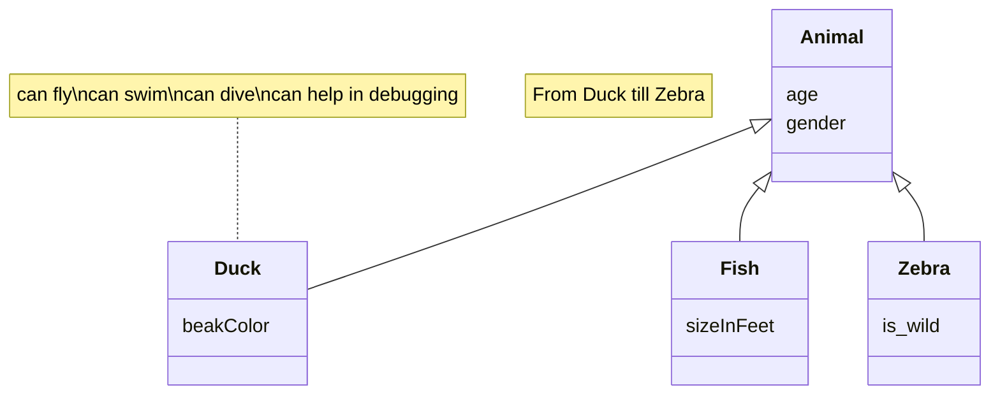

# Documento de análisis de requisitos del sistema

_Esta es una plantilla que sirve como guía para realizar este entregable. Por favor, mantén las mismas secciones y los contenidos que se indican para poder hacer su revisión más ágil._ 

## Introducción

En esta sección debes describir de manera general cual es la funcionalidad del proyecto a rasgos generales. ¿Qué valor puede aportar? ¿Qué objetivos pretendemos alcanzar con su implementación? ¿Cuántos jugadores pueden intervenir en una partida como máximo y como mínimo? ¿Cómo se desarrolla normalmente una partida?¿Cuánto suelen durar?¿Cuando termina la partida?¿Cuantos puntos gana cada jugador o cual es el criterio para elegir al vencedor?

[Enlace al vídeo de explicación de las reglas del juego / partida jugada por el grupo](http://youtube.com)

## Tipos de Usuarios / Roles

< Nombre Rol >: < Breve descripción del rol >

_Ej1: Propietario: Dueño de una o varias mascota que viene a la clínica para mantenerla sana y cuidar de su salud._

_Ej2: Veterinario: Profesional de la salud animal con titulación universitaria homologada, está registrado en la clínica y se encarga de realizar diagnósticos y recetar tratamientos. Además mantiene actualizado el vademécum._

_Ej3: Administrador: Dueño de la clínica que se encarga de dar de alta veterinarios y gestionar la información registrada en la aplicación de la clínica._

## Historias de Usuario

A continuación se definen  todas las historias de usuario a implementar usando la siguiente plantilla:

### HU-(ISSUE#ID): < Nombre > - [Enlace a la Issue asociada a la historia de usuario]()
Descripción de la historia siguiendo el esquema:  "Como <rol> quiero que el sistema <funcionalidad>  para poder <objetivo/beneficio>."
…
Mockup de Interfaz de usuario de la historia
…
Decripción de las interacciones concretas a realizar con la interfaz de usuario del sistema para lleva a cabo la historia. 

## Diagrama conceptual del sistema
En esta sección debe proporcionar un diagrama UML de clases que describa el modelo de datos a implementar en la aplicación. Este diagrama estará anotado con las restricciones simples (de formato/patrón, unicidad, obligatoriedad, o valores máximos y mínimos) de los datos a gestionar por la aplicación. 

_Recuerde que este es un diagrama conceptual, y por tanto no se incluyen los tipos de los atributos, ni clases específicas de librerías o frameworks, solamente los conceptos del dominio/juego que pretendemos implementar_
Ej:

## Reglas de Negocio
### R-< X > < Nombre Regla de negocio >
_< Descripción de la restricción a imponer >_

_Ej:_ 
### R1 – Diagnósticos imposibles
El diagnóstico debe estar asociado a una enfermedad que es compatible con el tipo de mascota de su visita relacionada. Por ejemplo, no podemos establecer como enfermedad diagnosticada una otitis cuando la visita está asociada a una mascota que es un pez, porque éstos no tienen orejas ni oídos (y por tanto no será uno de los tipos de mascota asociados a la enfermedad otitis en el vademecum).

…

_Muchas de las reglas del juego se transformarán en nuestro caso en reglas de negocio, por ejemplo, “la carta X solo podrá jugarse en la ronda Y si en la ronda anterior se jugó la carta Z”, o “en caso de que un jugador quede eliminado el turno cambia de sentido”_

