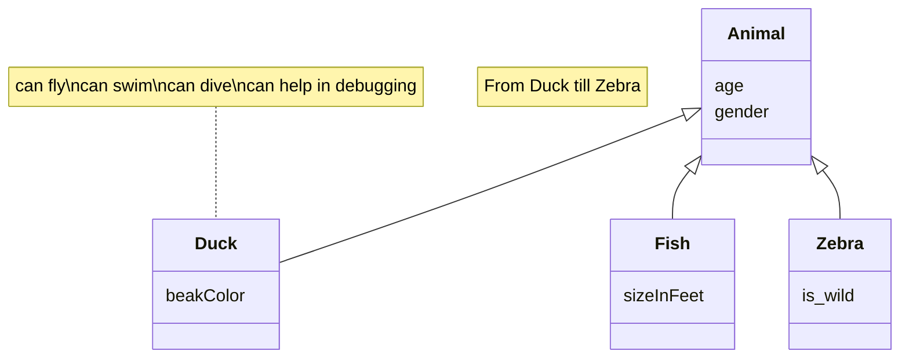

# Documento de diseño del sistema

_Esta es una plantilla que sirve como guía para realizar este entregable. Por favor, mantén las mismas secciones y los contenidos que se indican para poder hacer su revisión más ágil._ 

## Introducción

En esta sección debes describir de manera general cual es la funcionalidad del proyecto a rasgos generales. ¿Qué valor puede aportar? ¿Qué objetivos pretendemos alcanzar con su implementación? ¿Cuántos jugadores pueden intervenir en una partida como máximo y como mínimo? ¿Cómo se desarrolla normalmente una partida?¿Cuánto suelen durar?¿Cuando termina la partida?¿Cuantos puntos gana cada jugador o cual es el criterio para elegir al vencedor?

[Enlace al vídeo de explicación de las reglas del juego / partida jugada por el grupo](http://youtube.com)

## Diagrama(s) UML:

### Diagrama de Dominio/Diseño

_En esta sección debe proporcionar un diagrama UML de clases que describa el modelo de dominio, recuerda que debe estar basado en el diagrama conceptual del documento de análisis de requisitos del sistema pero que debe:_
•	_Especificar la direccionalidad de las relaciones (a no ser que sean bidireccionales)_
•	_Especificar la cardinalidad de las relaciones_
•	_Especificar el tipo de los atributos_
•	_Especificar las restricciones simples aplicadas a cada atributo de cada clase de domino_
•	_Incluir las clases específicas de la tecnología usada, como por ejemplo BaseEntity, NamedEntity, etc._
•	_Incluir los validadores específicos creados para las distintas clases de dominio (indicando en su caso una relación de uso con el estereotipo <<validates>>._

_Un ejemplo de diagrama para los ejercicios planteados en los boletines de laboratorio sería (hemos omitido las generalizaciones hacia BaseEntity para simplificar el diagrama):_

_Ej:_

### Diagrama de Capas (incluyendo Controladores, Servicios y Repositorios)
_En esta sección debe proporcionar un diagrama UML de clases que describa el conjunto de controladores, servicios, y repositorios implementados, incluya la división en capas del sistema como paquetes horizontales tal y como se muestra en el siguiente ejemplo:_

_El diagrama debe especificar además las relaciones de uso entre controladores y servicios, entre servicios y servicios, y entre servicios y repositorios._
_Tal y como se muestra en el diagrama de ejemplo, para el caso de los repositorios se deben especificar las consultas personalizadas creadas (usando la signatura de su método asociado)._

### Descomposición de los mockups más importantes en componentes

En esta sección procesaremos los mockups más importantes (*como mínimo debe realizarse para los componentes que va a permitir representar el tablero e interfaz de juego en las distintas fases de la partida*) creados para la interfaz de usuario en el documento de requisitos y etiquetaremos las zonas de cada una de las pantallas para identificar componentes a implementar. Para cada mockup se especificará el árbol de jerarquía de componentes, así como, para cada componente el estado que necesita mantener, las llamadas a la API que debe realizar y los parámetros de configuración global que consideramos que necesita usar cada componente concreto. 
Por ejemplo, para la pantalla de visualización de métricas del usuario en un hipotético módulo de juego social:

