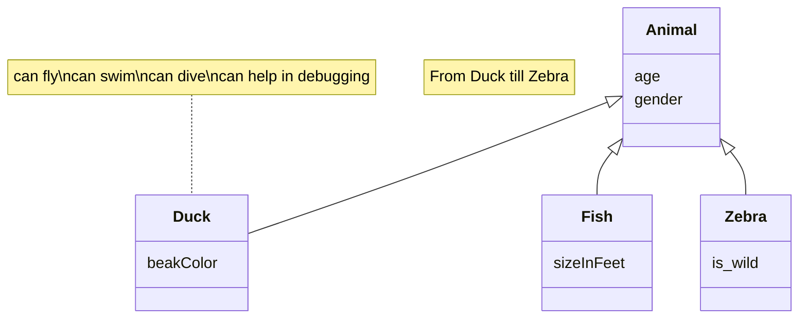

# Documento de diseño del sistema

_Esta es una plantilla que sirve como guía para realizar este entregable. Por favor, mantén las mismas secciones y los contenidos que se indican para poder hacer su revisión más ágil._ 

## Introducción

En esta sección debes describir de manera general cual es la funcionalidad del proyecto a rasgos generales. ¿Qué valor puede aportar? ¿Qué objetivos pretendemos alcanzar con su implementación? ¿Cuántos jugadores pueden intervenir en una partida como máximo y como mínimo? ¿Cómo se desarrolla normalmente una partida?¿Cuánto suelen durar?¿Cuando termina la partida?¿Cuantos puntos gana cada jugador o cual es el criterio para elegir al vencedor?

[Enlace al vídeo de explicación de las reglas del juego / partida jugada por el grupo](http://youtube.com)

## Diagrama(s) UML:

### Diagrama de Dominio/Diseño

_En esta sección debe proporcionar un diagrama UML de clases que describa el modelo de dominio, recuerda que debe estar basado en el diagrama conceptual del documento de análisis de requisitos del sistema pero que debe:_
•	_Especificar la direccionalidad de las relaciones (a no ser que sean bidireccionales)_
•	_Especificar la cardinalidad de las relaciones_
•	_Especificar el tipo de los atributos_
•	_Especificar las restricciones simples aplicadas a cada atributo de cada clase de domino_
•	_Incluir las clases específicas de la tecnología usada, como por ejemplo BaseEntity, NamedEntity, etc._
•	_Incluir los validadores específicos creados para las distintas clases de dominio (indicando en su caso una relación de uso con el estereotipo <<validates>>._

_Un ejemplo de diagrama para los ejercicios planteados en los boletines de laboratorio sería (hemos omitido las generalizaciones hacia BaseEntity para simplificar el diagrama):_

_Ej:_

### Diagrama de Capas (incluyendo Controladores, Servicios y Repositorios)
_En esta sección debe proporcionar un diagrama UML de clases que describa el conjunto de controladores, servicios, y repositorios implementados, incluya la división en capas del sistema como paquetes horizontales tal y como se muestra en el siguiente ejemplo:_

_El diagrama debe especificar además las relaciones de uso entre controladores y servicios, entre servicios y servicios, y entre servicios y repositorios._
_Tal y como se muestra en el diagrama de ejemplo, para el caso de los repositorios se deben especificar las consultas personalizadas creadas (usando la signatura de su método asociado)._

## Descomposición de los mockups más importantes en componentes

En esta sección procesaremos los mockups más importantes (*como mínimo debe realizarse para los componentes que va a permitir representar el tablero e interfaz de juego en las distintas fases de la partida*) creados para la interfaz de usuario en el documento de requisitos y etiquetaremos las zonas de cada una de las pantallas para identificar componentes a implementar. Para cada mockup se especificará el árbol de jerarquía de componentes, así como, para cada componente el estado que necesita mantener, las llamadas a la API que debe realizar y los parámetros de configuración global que consideramos que necesita usar cada componente concreto. 
Por ejemplo, para la pantalla de visualización de métricas del usuario en un hipotético módulo de juego social:

  - App – Componente principal de la aplicación
    - $\color{orange}{\textsf{NavBar – Barra de navegación lateral}}$
      - $\color{darkred}{\textsf{[ NavButton ]. Muestra un botón de navegación con un icono asociado.}}$
    - $\color{darkblue}{\textsf{UserNotificationArea – Área de notificaciones e identificación del usuario actual}}$
    - $\color{blue}{\textsf{MetricsBar – En este componente se muestran las métricas principales del juego. Se mostrarán 4 métricas: partidas jugadas, puntos logrados, tiempo total, y cartas jugadas.}}$
      - $\color{darkgreen}{\textsf{[ MetricWell ] – Proporciona el valor y el incremento semanal de una métrica concreta. }}$
    - $\color{purple}{\textsf{GamesEvolutionChart – Muestra la tendencia de evolución en ellos últimos 4 meses en cuanto a partida jugadas, ganadas, perdidas y abandonadas.}}$
    - $\color{yellow}{\textsf{PopularCardsChart – Muestra la proporción de las N (parámetro de configuración) cartas más jugadas en el juego por el jugador.}}$
    - $\color{red}{\textsf{FrequentCoPlayersTable – Muestra los jugadores  con los que más se  ha jugado (de M en M donde M es un parámetro definido por la configuración del componente). Concretamente, se mostrarán la el nombre, la fecha de la última partida, la localización del jugador el porcentaje de partidas jugadas por ambos en las que el usuario ha ganado y si el jugador es amigo o no del usuario.}}$

## Documentación de las APIs
Se considerará parte del documento de diseño del sistema la documentación generada para las APIs, que debe incluir como mínimo, una descripción general de las distintas APIs/tags  proporcionadas. Una descripción de los distintos endpoints y operaciones soportadas. Y la especificación de las políticas de seguridad especificadas para cada endpoint y operación. Por ejemplo: “la operación POST sobre el endpoint /api/v1/game, debe realizarse por parte de un usuario autenticado como Player”.

Si lo desea puede aplicar la aproximación descrita en https://vmaks.github.io/2020/02/09/how-to-export-swagger-specification-as-html-or-word-document/ para generar una versión en formato Word de la especificación de la API generada por OpenAPI, e incluirla en esta sección del documento.  En caso contrario debe asegurarse de que la interfaz de la documentación open-api de su aplicación está accesible, funciona correctamente, y está especificada conforme a las directrices descritas arriba.

## Patrones de diseño y arquitectónicos aplicados
En esta sección de especificar el conjunto de patrones de diseño y arquitectónicos aplicados durante el proyecto. Para especificar la aplicación de cada patrón puede usar la siguiente plantilla:

### Patrón: < Nombre del patrón >
*Tipo*: Arquitectónico | de Diseño

*Contexto de Aplicación*

Describir las partes de la aplicación donde se ha aplicado el patrón. Si se considera oportuno especificar el paquete donde se han incluido los elementos asociados a la aplicación del patrón.

*Clases o paquetes creados*

Indicar las clases o paquetes creados como resultado de la aplicación del patrón.

*Ventajas alcanzadas al aplicar el patrón*

Describir porqué era interesante aplicar el patrón.

## Decisiones de diseño
_En esta sección describiremos las decisiones de diseño que se han tomado a lo largo del desarrollo de la aplicación que vayan más allá de la mera aplicación de patrones de diseño o arquitectónicos._

### Decisión X
#### Descripción del problema:*

Describir el problema de diseño que se detectó, o el porqué era necesario plantearse las posibilidades de diseño disponibles para implementar la funcionalidad asociada a esta decisión de diseño.

#### Alternativas de solución evaluadas:
Especificar las distintas alternativas que se evaluaron antes de seleccionar el diseño concreto implementado finalmente en el sistema. Si se considera oportuno se pude incluir las ventajas e inconvenientes de cada alternativa

#### Justificación de la solución adoptada

Describir porqué se escogió la solución adoptada. Si se considera oportuno puede hacerse en función de qué  ventajas/inconvenientes de cada una de las soluciones consideramos más importantes.
Os recordamos que la decisión sobre cómo implementar las distintas reglas de negocio, cómo informar de los errores en el frontend, y qué datos devolver u obtener a través de las APIs y cómo personalizar su representación en caso de que sea necesario son decisiones de diseño relevantes.

_Ejemplos de uso de la plantilla con otras decisiones de diseño:_

### Decisión 1: Importación de datos reales para demostración
#### Descripción del problema:

Como grupo nos gustaría poder hacer pruebas con un conjunto de datos reales suficientes, porque resulta más motivador. El problema es al incluir todos esos datos como parte del script de inicialización de la base de datos, el arranque del sistema para desarrollo y pruebas resulta muy tedioso.

#### Alternativas de solución evaluadas:

*Alternativa 1.a*: Incluir los datos en el propio script de inicialización de la BD (data.sql).

*Ventajas:*
•	Simple, no requiere nada más que escribir el SQL que genere los datos.
*Inconvenientes:*
•	Ralentiza todo el trabajo con el sistema para el desarrollo. 
•	Tenemos que buscar nosotros los datos reales

*Alternativa 1.b*: Crear un script con los datos adicionales a incluir (extra-data.sql) y un controlador que se encargue de leerlo y lanzar las consultas a petición cuando queramos tener más datos para mostrar.
*Ventajas:*
•	Podemos reutilizar parte de los datos que ya tenemos especificados en (data.sql).
•	No afecta al trabajo diario de desarrollo y pruebas de la aplicación
*Inconvenientes:*
•	Puede suponer saltarnos hasta cierto punto la división en capas si no creamos un servicio de carga de datos. 
•	Tenemos que buscar nosotros los datos reales adicionales

*Alternativa 1.c*: Crear un controlador que llame a un servicio de importación de datos, que a su vez invoca a un cliente REST de la API de datos oficiales de XXXX para traerse los datos, procesarlos y poder grabarlos desde el servicio de importación.

*Ventajas:*
•	No necesitamos inventarnos ni buscar nosotros lo datos.
•	Cumple 100% con la división en capas de la aplicación.
•	No afecta al trabajo diario de desarrollo y pruebas de la aplicación
*Inconvenientes:*
•	Supone mucho más trabajo. 
•	Añade cierta complejidad al proyecto

*Justificación de la solución adoptada*
Como consideramos que la división en capas es fundamental y no queremos renunciar a un trabajo ágil durante el desarrollo de la aplicación, seleccionamos la alternativa de diseño 1.c.

